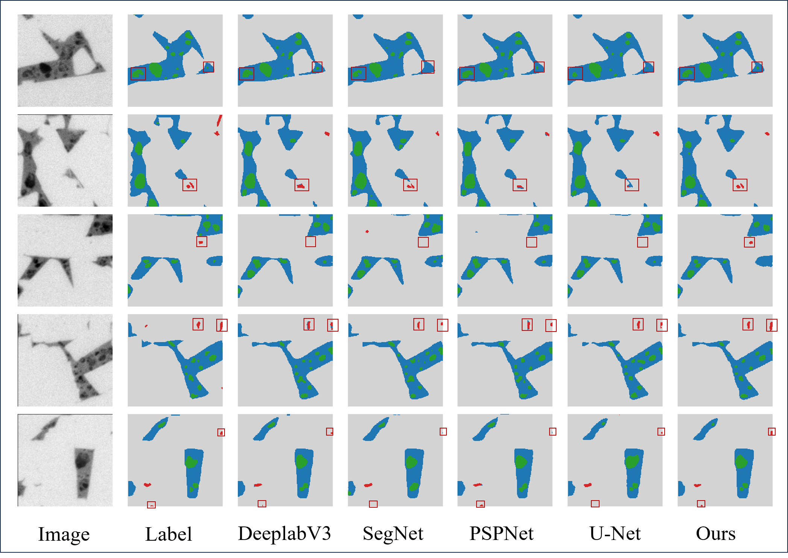
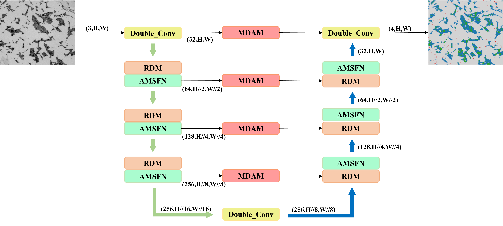

# RDAMU-Net: Integrating Dilated Residuals, Adaptive Multi-Scale Fusion, and Multi-Dimensional Attention for Shale Microstructure Segmentation 

<div align="center">
  
[](https://opensource.org/licenses/Apache-2.0) [](https://www.python.org/downloads/)


<em>▲ Figure1: Prediction results comparison of different models</em>

</div>

## 📖 Table of Contents
- [🌟 Core Contributions](#-core-contributions)
- [⚡ Quick Start](#-quick-start)
- [📦 Data Preparation](#-data-preparation)
- [©️ License](#️-license)
- [📕 Statement](#-statement)

---

## 🌟 Core Contributions
### 🔍 RDAMU-Net
<div align="center">


<em>▲ Figure2: RDAMU-Net</em>

</div>


## ⚡ Quick Start
**1. Clone Repository**
```bash
git clone https://github.com/your_project
```

**2. Configure Training Parameters**
```bash
python train.py \
   --csv_path your_dataset.csv \
   --model model \
   --save_dir outputs
   ```

## 📦 Data Preparation
### 📂 File Structure
```text
datasets/
├── csv/           # Data paths
├── images/        # Raw images 
└── masks/         # masks
```

### 🔄 Generate CSV File
```python
from utils.my_data import save_sem_paths_to_csv
save_sem_paths_to_csv("root_path", "csv_path", "csv_name")
```

## ©️ License
This project is licensed under the [Apache License 2.0](./LICENSE).

## 📕 Statement
The code in this repository is for academic research use only. Commercial use is strictly prohibited without permission.
